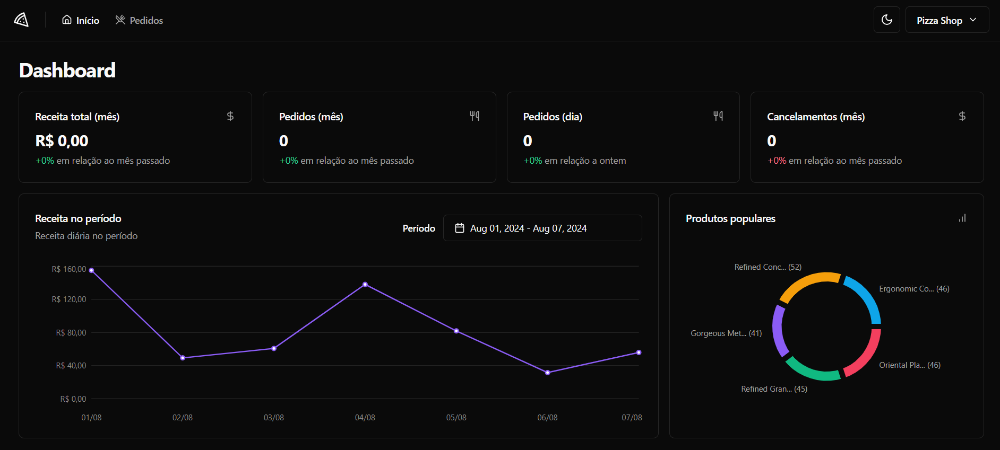

# React + TypeScript + Vite

### How to run

- run `npm i`
- run `npm run dev`
- Use [this repo](https://github.com/rocketseat-education/pizzashop-api) for the backend and follow the README instructions there

